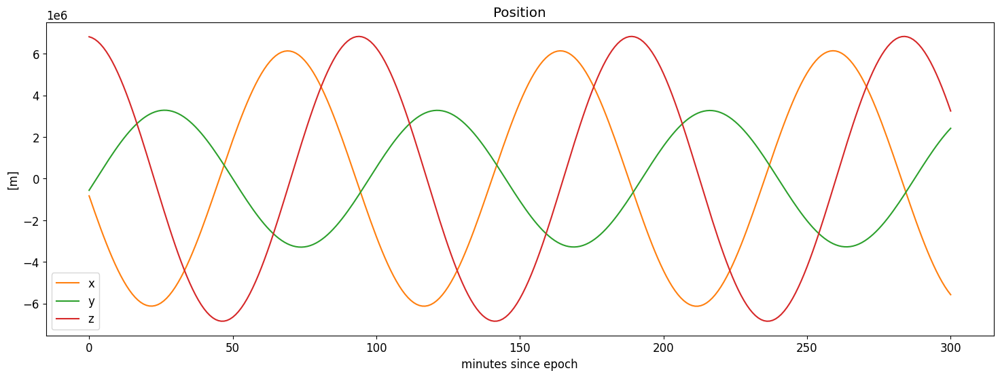

# Introduction

The sections below relate directly to the tasks described in the [assignment text](README.md). In each one, you will find a short statement requesting you to give a short answer. Below that statement there are a few characters, for example `NORAD_CAT_ID`. Replace that string, and only that string, with your answer. 

Please remember:

- Do not edit anything else in this answer sheet.
- Do not use any kind of formatting, e.g. `something`.
- Only report what is asked, do not answer in a sentence:
    - wrong: "I selected NORAD Id 99999"
    - correct: "99999"
- You may use multiple lines to answer, if needed. 
- For numerical answers involving fractional numbers:
    - use scientific notation with 6 significant digits: `-1.23456e-1`
    - in case multiple values are requested, e.g. when reporting vectorial quantities, separate each component with a blank space(s): `-1.23456e-1 -2.34561e-2 -3.45612e-3`

# 1 Pick a satellite 

Report the NORAD Id you selected.

32789

# 2 Retrieve the orbital elements

Report the TLE data you retrieved. If you retrieved TLE data in `KVN`, `XML`, `JSON` or `CSV` formats, report it in `TLE` format.

DELFI-C3 (DO-64)
1 32789U 08021G   22311.04873525  .00016534  00000+0  82325-3 0  9994
2 32789  97.3291 332.4371 0009552 174.0994 186.0355 15.17618347793628

# 3 Implement the SGP4 propagator (code answer: 8 points)

Report the URL or GitHub repository of the SGP4 implementation you will be using.

https://rhodesmill.org/pyephem/

Report the command that you use in the CLI to generate the orbit data.

./get-TLE.sh 32789 | ./propagate.py 2> /dev/null

# 4 Generate an orbit

Report the start time of your time domain, in terms of minutes since the epoch of you TLE data.

0

Report the stop time of your time domain, in terms of minutes since the epoch of you TLE data.

300

Report the time step in your time domain, in terms of minutes.

1

Report the motivation that led you to choose the values of the parameters above, i.e., start/stop times and time step (open text answer: 4 points).

1. stop time is sufficient large to show 3 orbital revolutions
2. step is sufficiently long to limit the number of orbit data points
3. step is short enough to plot the data with no visible artefacts.

Report the first data point, i.e. time, position x, y, z, velocity x, y, z, from the orbit data you generated with the SGP4 propagator (numeric answer: 8 points).

0.000000000000e+00 -8.256491316528e+05 -5.573487335012e+05 6.810163171715e+06 -6.694011982816e+03 3.577193922498e+03 -5.249961908335e+02

Report the last data point from the orbit data you generated with the SGP4 propagator (numeric answer: 8 points).

2.500000000000e+02 5.071972339114e+06 -2.021140554375e+06 -4.224314326433e+06 3.806407572330e+03 -2.834730075673e+03 5.925271116968e+03

# 5 Plot your orbit

Report the markdown code (see [this link](https://docs.gitlab.com/ee/user/markdown.html#images)) that adds your plot to this document (graphic answer: 16 points).

Report the command that you use in the CLI to generate your plot.

COR_PLOT_COM

Make three observations about the data you plotted (open text answer: 8 points).

1. All components have similar amplitude and period
2. The y-component has the lowest amplitude
3. The minimum and maximum values of each component remain the same

Make two interpretations about the observations you reported above (open text answer: 14 points).

1. The orbit is stable
2. The angle between the orbital plane and the x-z plane is the smaller than the angles between the orbital plane and the x-y or y-z planes.

Make one conclusions based on the observations and interpretations you reported above (open text answer: 14 points).

1. The lines represents periodic motion in 3D

# Final remarks

Report the steps you have taken to address Code Excellence. Report "none" if relevant (code excellence answer: possible 20 points).

EXC_CODE

Report the steps you have taken to address Assignment Excellence. Report "none" if relevant.

- use CLI tools to retrieve this data programmatically (assignment excellence answer: possible 4 points):

File get-TLE.sh uses curl to retrieve the TLE data from celestrak.org

- implement parsing additional TLE format(s) in your program (assignment excellence answer: possible 4 points):

EXC_ASSIGN_2

- implement multiple methods to communicate the parameters with your SGP4 propagator (assignment excellence answer: possible 4 points):

EXC_ASSIGN_3

- automate the whole workflow (assignment excellence answer: possible 8 points):

./get-TLE.sh 32789 | ./propagate.py | ./plot-files.py --files stdin --labels t,x,y,z --out pos.png [...]
